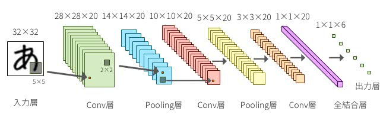

# 畳み込みニューラルネットワーク

- Convolutional Neural Network (CNN)
- ディープラーニングといえばCNNが例に挙げられる
- CNNだけがディープラーニング ではない


## 畳み込み？

- 関数  を平行移動しながら関数  に重ね足し合わせる二項演算
- 畳み込み積分、合成積、重畳積分、あるいは英語に倣いコンボリューションとも呼ばれる


## 畳み込みニューラルネットワーク

- (畳み込み層とプーリング層)を複数個，(全結合層と出力層)を1個
- 畳み込みを二層連続で仕込んだりもします（けっこう自由）
- 隠れ層が多いので，深層学習（ディープラーニング）


### 畳み込み層

- フィルターを設定して入力データに対して走査して畳み込む
- ずれなどノイズを吸収しながら，特徴量データを抽出する


### プーリング層
- 畳み込んだデータに足して特定範囲内の最大値や平均などを抽出する
- 位置ずれなどに強い
- 画像圧縮的な役割で学習コストを下げる
- 設定しないモデルもある

### 全結合層
- 従来通りの積和演算して活性化関数に投げるやつ
- 識別的な動き

### ドロップアウト層
- ランダムに全結合層の出力をカットする
- 過学習の防止
- 設定しないモデルもある

## CNNの特徴
- 画像認識・識別に強いと言われる
- 畳み込み層が画像ノイズを吸収してくれる




# （例題）MNISTを使った手書き数字認識

手描き文字認識をCNNで実装しましょう

## MNIST

- Modified National Institute of Standards and Technology database
- チュートリアル的な手書き文字認識のデータベース
- 識別クラス番号が数字の番号に対応してて初心者に優しい
- データがKerasの標準APIで取得できる

  


## 学習

- MNISTデータはKerasが事前に用意してある
- ソースを見ての通りデータの準備や正規化の手間が大きい
- 隠れ層はKerasがやってくれるので深く考えないでいい
- MacBook Air (13-inch, Early 2015) で，だいたい1時間かかる

```
import keras
from keras.datasets import mnist
from keras.models import Sequential
from keras.layers import Dense, Dropout, Flatten
from keras.layers import Conv2D, MaxPooling2D
from keras import backend as K
import os.path

batch_size = 128
num_classes = 10 # 0から9の文字認識
epochs = 12

# input ../image dimensions
img_rows, img_cols = 28, 28

# the data, shuffled and split between train and test sets
(x_train, y_train), (x_test, y_test) = mnist.load_data()

if K.../image_data_format() == 'channels_first':
    x_train = x_train.reshape(x_train.shape[0], 1, img_rows, img_cols)
    x_test = x_test.reshape(x_test.shape[0], 1, img_rows, img_cols)
    input_shape = (1, img_rows, img_cols)
else:
    x_train = x_train.reshape(x_train.shape[0], img_rows, img_cols, 1)
    x_test = x_test.reshape(x_test.shape[0], img_rows, img_cols, 1)
    input_shape = (img_rows, img_cols, 1)

x_train = x_train.astype('float32')
x_test = x_test.astype('float32')
x_train /= 255
x_test /= 255
print('x_train shape:', x_train.shape)
print(x_train.shape[0], 'train samples')
print(x_test.shape[0], 'test samples')

# convert class vectors to binary class matrices
y_train = keras.utils.to_categorical(y_train, num_classes)
y_test = keras.utils.to_categorical(y_test, num_classes)

model = Sequential()
model.add(Conv2D(32,
                 kernel_size=(3, 3),
                 activation='relu',
                 input_shape=input_shape))
model.add(Conv2D(64, (3, 3), activation='relu'))
model.add(MaxPooling2D(pool_size=(2, 2)))
model.add(Dropout(0.25))
model.add(Flatten())
model.add(Dense(128, activation='relu'))
model.add(Dropout(0.5))
model.add(Dense(num_classes, activation='softmax'))

model.compile(loss=keras.losses.categorical_crossentropy,
              optimizer=keras.optimizers.Adadelta(),
              metrics=['accuracy'])

logPath = "./data/06_cnn01/log"
os.makedirs(logPath, exist_ok=True)

tb_cb = keras.callbacks.TensorBoard(log_dir=logPath, histogram_freq=1, write_graph=True)
cbks = [tb_cb]

model.fit(x_train,
          y_train,
          batch_size=batch_size,
          epochs=epochs,
          verbose=1,
          validation_data=(x_test, y_test),
          callbacks=cbks)
score = model.evaluate(x_test, y_test, verbose=0)
print('Test loss:', score[0])
print('Test accuracy:', score[1])


path = "./data/06_cnn01"
fileName = path + "/06_cnn01.h5"

os.makedirs(path, exist_ok=True)
model.save(fileName)
```


## 推論

- 全コードで学習したモデルとパラメータを読み込む
- 適当な入力画像を用意して，推論する
- 拡大縮小や回転に対応していなので，データによっては失敗多発

  


```
import numpy as np
from keras.models import load_model
from PIL import ../image

path = "./data/06_cnn01"
fileName = path + "/06_cnn01.h5"
../imageName = path + "/test4-2.png"

# モデルの読込
model = load_model(fileName)
print("completed to load a CNN model from ", fileName)

# 入力画像の読込
../image = ../image.open(../imageName).convert('L')
../image = ../image.resize((28, 28), ../image.ANTIALIAS)
data = np.asarray(../image, dtype=float)

# 画像の正規化
data = data.reshape(1, 28, 28, 1)
input_shape = (28, 28, 1)
data = data.astype('float32')
data /= 255

# 入力予測
classes = model.predict_classes(data, batch_size=32)
print("classes = ", classes)
```


---

# 参考リンク

- [畳み込み - Wikipedia](https://ja.wikipedia.org/wiki/%E7%95%B3%E3%81%BF%E8%BE%BC%E3%81%BF "畳み込み - Wikipedia")
- [Deep learningで画像認識④〜畳み込みニューラルネットワークの構成〜 - IMACEL Academy -人工知能・画像解析の技術応用に向けて-|LPixel(エルピクセル)](https://lp-tech.net/articles/LVB9R "Deep learningで画像認識④〜畳み込みニューラルネットワークの構成〜 - IMACEL Academy -人工知能・画像解析の技術応用に向けて-|LPixel(エルピクセル)")
- [Convolutional Neural Networkとは何なのか - Qiita](http://qiita.com/icoxfog417/items/5fd55fad152231d706c2 "Convolutional Neural Networkとは何なのか - Qiita")
- [定番のConvolutional Neural Networkをゼロから理解する - DeepAge](https://deepage.net/deep_learning/2016/11/07/convolutional_neural_network.html "定番のConvolutional Neural Networkをゼロから理解する - DeepAge")
- [MNIST（１） - 備忘録](http://himajin.ddo.jp/blog/archives/213 "MNIST（１） - 備忘録")
- [keras/mnist_cnn.py at master · fchollet/keras](https://github.com/fchollet/keras/blob/master/examples/mnist_cnn.py "keras/mnist_cnn.py at master · fchollet/keras")
- [深層学習やってみる - Kerasで手書き数字認識（MNIST） - ポンダッドの日記](https://pondad.net/ai/2016/12/25/keras-mnist.html "深層学習やってみる - Kerasで手書き数字認識（MNIST） - ポンダッドの日記")
- [Python 3.5 対応画像処理ライブラリ Pillow (PIL) の使い方 - Librabuch](https://librabuch.jp/blog/2013/05/python_pillow_pil/ "Python 3.5 対応画像処理ライブラリ Pillow (PIL) の使い方 - Librabuch")
- [Pillow(Python Imaging Library)のインストールと簡単なサンプルコード | mwSoft](http://www.mwsoft.jp/programming/computer_vision_with_python/1_1_pil.html "Pillow(Python Imaging Library)のインストールと簡単なサンプルコード | mwSoft")
- [MNIST For ML Beginners  |  TensorFlow](https://www.tensorflow.org/get_started/mnist/beginners "MNIST For ML Beginners  |  TensorFlow")
- [MNIST handwritten digit database, Yann LeCun, Corinna Cortes and Chris Burges](http://yann.lecun.com/exdb/mnist/ "MNIST handwritten digit database, Yann LeCun, Corinna Cortes and Chris Burges")