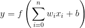

# ニューラルネットワーク（neural network）

- 脳機能に見られるいくつかの特性を計算機上のシミュレーションによって表現することを目指した数学モデル
- 生物特性を模倣したモデルは他に遺伝的アルゴリズムとかもある

## ニューロンの動作

- ニューロンは複数のシナプスから入力信号を受ける
- ニューロン内である電位（閾値）を超えると興奮し，次のニューロンに信号を送る
- 詳しくは中高の生物を参考

## パーセプトロン

- もっとも単純なNN（単純パーセプトロン）

入力を，それぞれの重みを，バイアス（閾値に相当する）をとすると，出力は以下のように定義される

ここで，は活性化関数であり，ステップ関数，シグモイド関数やReLU(ランプ関数)が使われる．

## 学習

パラメータ学習は前回例題と同様に損失関数を設定し，それを最小にするパラメータを求める．

- 計算詳細はコーティングに特別必要ではないので省略する．
- 偏微分で最小値問題は，解けない場合が多いので，近似値計算で求める

## 実際には

- 単純パーセプトロンでは非線形問題が解けない
- 隠れ層を設定していく（多層パーセプトロン）

# 深層学習（ディープラーニング, deep learning）

ディープラーニングとは

- 多層化されたニューラルネットワーク

ニューラルネットワークは一時期廃れていた

- 層を増やせば精度が上がるだろうが，計算時間が莫大すぎる
- PCの進化，GPUの並列計算や計算用クラウドにより，日の目を見ることになる

とはいえ

- 計算時間はいまだにかかる
- NVIDIAのGPUを載せて，じゃぶじゃぶ計算させるのが今の主流

# 参考URL

- [ニューラルネットワーク - Wikipedia](https://ja.wikipedia.org/wiki/%E3%83%8B%E3%83%A5%E3%83%BC%E3%83%A9%E3%83%AB%E3%83%8D%E3%83%83%E3%83%88%E3%83%AF%E3%83%BC%E3%82%AF "ニューラルネットワーク - Wikipedia")
- [村上・泉田研究室　ニューラルネットワーク](http://ipr20.cs.ehime-u.ac.jp/column/neural/chapter2.html "村上・泉田研究室　ニューラルネットワーク")
- [活性化関数 - Wikipedia](https://ja.wikipedia.org/wiki/%E6%B4%BB%E6%80%A7%E5%8C%96%E9%96%A2%E6%95%B0 "活性化関数 - Wikipedia")
- [3章ニューラルネットワーク(ステップ関数・シグモイド関数・ReLU関数）『ゼロから作るディープラーニング』 - 人工知能エンジニア修行日記](http://kaeken.hatenablog.com/entry/2016/11/03/232414 "3章ニューラルネットワーク(ステップ関数・シグモイド関数・ReLU関数）『ゼロから作るディープラーニング』 - 人工知能エンジニア修行日記")
- [【Ruby】機械学習をするためのgemをつくった - Qiita](http://qiita.com/seinosuke/items/ba16be7a469a756490be "【Ruby】機械学習をするためのgemをつくった - Qiita")
- [今日から始めるDeep Learning | eureka tech blog](https://developers.eure.jp/tech/start_deep_learning_today/ "今日から始めるDeep Learning | eureka tech blog")
- [DeepLearning系ライブラリ、Kerasがあまりにも便利だったので使い方メモ - プロクラシスト](http://www.procrasist.com/entry/2017/01/07/154441 "DeepLearning系ライブラリ、Kerasがあまりにも便利だったので使い方メモ - プロクラシスト")

