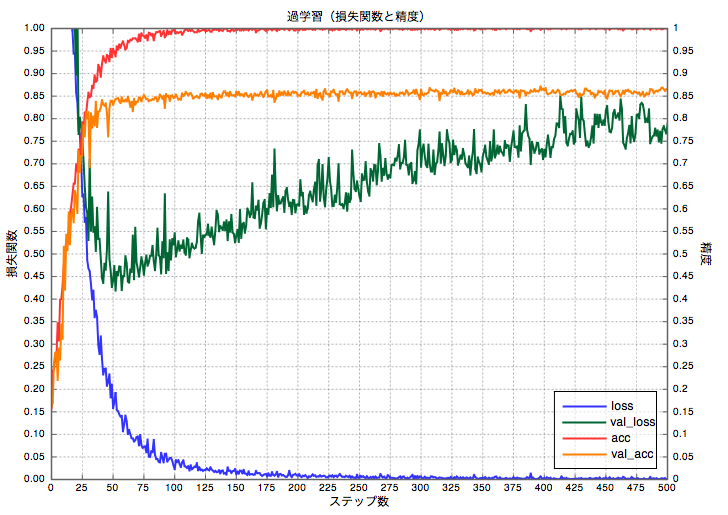

# 過学習

- 訓練データに対して学習されているが、未知データ（テストデータ）に対しては適合できていない、汎化できていない状態

# 損失関数と精度

- 損失関数を最小にするパラメータを求めて行く
- 訓練データでの損失関数(loss)が最小になるにつれて，バリデーションデータ（validation, val_loss）は大きくなる
- 訓練データに対して過剰に最適化されるため，未知データに対して精度が悪くなる
- lossだけを見ずに損失関数と精度を考慮して，早々に切り上げるのがよい



# Kerasで過学習を防ぐ

## バリデーションデータを与えて，学習する

バリデーションデータを指定して，学習を開始する

```
model.fit(x_train,
          y_train,
          batch_size=batch_size,
          epochs=epochs,
          verbose=1,
          validation_data=(x_test, y_test),
          callbacks=callbacks)
```

```validation_data```ではなく，```validation_split```を使えば，指定した訓練データから指定した割合をバリデーションデータとして扱うことができる．

```
validation_split=0.2
```

しかし，そのバリデーションデータはランダム選択ではないため，データが偏る，通常は別にバリデーションデータ（テストデータ）を用意した方がよい．

## コールバックで監視する

コールバックの定義を以下のようにしておきます（上のコード例と同じ）
```
callbacks = []
```

```EarlyStopping```をコールバックに指定すると．デフォルトで```val_loss```を監視して，条件にあえば学習を終了する

```
callbacks.append(keras.callbacks.EarlyStopping())
```

しかし，不具合？か数回で終了するので，自作クラスを作るとよい．

```
class EarlyStoppingByLossVal(Callback):
    def __init__(self, monitor='val_loss', value=0.10, verbose=0):
        super(Callback, self).__init__()
        self.monitor = monitor
        self.value = value
        self.verbose = verbose

    def on_epoch_end(self, epoch, logs={}):
        current = logs.get(self.monitor)
        if current is None:
            warnings.warn("Early stopping requires %s available!" % self.monitor, RuntimeWarning)

        if current < self.value:
            if self.verbose > 0:
                print("Epoch %05d: early stopping THR" % epoch)
            self.model.stop_training = True
```
            
```
cb_es = EarlyStoppingByLossVal(monitor='val_loss', value=0.10, verbose=1)
callbacks.append(cb_es)
```

コールバックは複数設定可能．条件は ```or``` でどちらかが満たされれば終了される（はず）．

```
cb_es1 = keras.callbacks.EarlyStopping(monitor='loss', min_delta=0.01, patience=10, verbose=1)
callbacks.append(cb_es1)

cb_es2 = EarlyStoppingByLossVal(monitor='val_loss', value=0.10, verbose=1)
callbacks.append(cb_es2)
```
    
# その他

データや問題により，```loss```や```val_loss```の数値を監視しても決め手がかける場合（その方が多い）は，コールバックで随時重みを保存しておいて，TensorBoardでグラフを監視する方がいいかもしれない（もともこうもない）．


# 参考URL

- [過剰適合 - Wikipedia](https://ja.wikipedia.org/wiki/%E9%81%8E%E5%89%B0%E9%81%A9%E5%90%88 "過剰適合 - Wikipedia")
- [Sequentialモデル - Keras Documentation](https://keras.io/ja/models/sequential/ "Sequentialモデル - Keras Documentation")
- [コールバック - Keras Documentation](https://keras.io/ja/callbacks/ "コールバック - Keras Documentation")

