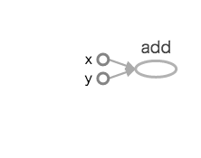
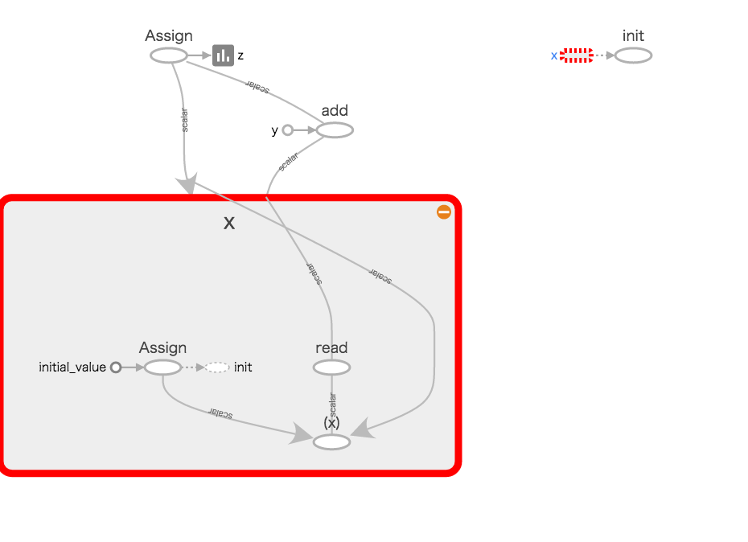

# TensorFlowとは

2015年11月、米Google社がオープンソース化した機械知能(Machine Intelligence)向けの計算 フレームワーク。2017年2月に開催されたTensorFlow Developer Summitにおいて、はじめての安定版リリース「バージョン1.0.0」が発表された。
 
* TensorFlow ≠ 機械学習
* TensorFlow = 機械学習に便利な数値計算フレームワーク

TensorFlowの有名どころなど

- [Google Cloud Platform Japan 公式ブログ: キュウリ農家とディープラーニングをつなぐ TensorFlow](https://cloudplatform-jp.googleblog.com/2016/08/tensorflow_5.html "Google Cloud Platform Japan 公式ブログ: キュウリ農家とディープラーニングをつなぐ TensorFlow")
- [【CCB9】きゅうり仕分け機試作２号機 | Workpiles](http://workpiles.com/2016/08/ccb9-prototype2-complete/ "【CCB9】きゅうり仕分け機試作２号機 | Workpiles")

バージョンアップの頻度が比較的早いので資料を漁る時は注意．（インストールやセットアップなどの手順は省略）

# PythonでTensorFlowを使ってみた

単純な加算のサンプルソース（インタプリタで逐次入力するか，ソースファイルを作成し```$ python hogehoge.py```で実行する）．

```
import tensorflow as tf
x = tf.constant(1)
y = tf.constant(2)
z = x + y
print("z = ", z)
```

実行結果

```
z = Tensor("add:0", shape=(), dtype=int32)
```

なぜ？

- TensorFlowは計算グラフを作成する
- セッション開始するまで計算されない
- 反復計算，並列計算に特化するため

  

セッション開始を追加

```
import tensorflow as tf
x = tf.constant(1)
y = tf.constant(2)
z = x + y
sess = tf.Session()
print(sess.run(z))
```
```
z = 3
```

おなじみHello Worldもセッションを開始する

```
import tensorflow as tf
hello = tf.constant('Hello, TensorFlow!')
sess = tf.Session()
print(sess.run(hello))
```
```
'Hello, TensorFlow!'
```

繰り返し計算してみた
- z = x + yを計算し，その結果をxに代入し繰り返すだけ


```
import tensorflow as tf
x = tf.Variable(1)
y = tf.constant(2)
z = x + y
z = tf.assign(x, z)

sess = tf.Session()
sess.run(tf.global_variables_initializer())
for step in range(100):
    print("step ", step, " z = ", sess.run(z))
```


## データ構造

shapeとは？

```
z = Tensor("add:0", shape=(), dtype=int32)
```

### Rank
- データの次元数に当たるもの
- ```[```の数

| Rank | 名称 | コード例 |
| :---: |:---:| :---:|
| 0 | スカラー | ```tf.constant(1)``` |
| 1 | ベクトル | ```tf.constant([1])``` とか ```tf.constant([1, 2])``` |
| 2 | 行列 | ```tf.constant([[1,2,3], [4,5,6], [7,8,9,]])``` |
| 3 | 3-Tensor | ```tf.constant([[[1,2], [3,4]], [[5,6], [7,8]]]``` |

### Shape
- 1次元目の要素数、2次元目の要素数、n次元目の要素数

```
# shape=(4, 3)
tf.constant([[1 2 3],
             [4 5 6],
             [7 8 9],
             [0 2 3]])
```


高次のデータ構造になると想像つかなくて混乱するけど，正直なところデータはTensorFlowがうまく取り扱ってくれるから，そこまで心配しなくてもいい


# 参考URL
- [TensorFlow](https://www.tensorflow.org/ "TensorFlow")
- [TensorBoardで処理を可視化する | mwSoft](http://www.mwsoft.jp/programming/tensor/tutorial_tensorboad.html "TensorBoardで処理を可視化する | mwSoft")


