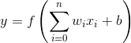
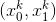
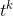
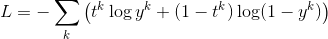
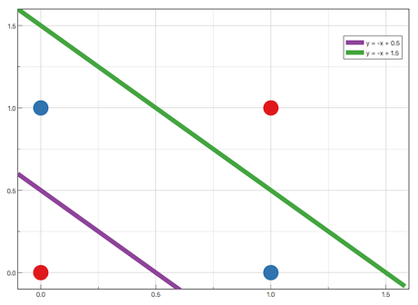

# （例題1）論理回路（AND）をNNで表現する

| 入力0 | 入力1 | 出力 |
| :-: |:-:| :-:|
| 0 | 0 | 0 |
| 0 | 1 | 1 |
| 1 | 0 | 1 |
| 1 | 1 | 1 |


入力を，それぞれの重みを，バイアス（閾値に相当する）をとすると，出力は以下のように定義される



活性化関数  にシグモイド関数を用いる．2状態の分類問題なので損失関数は，訓練データの入力  に対する出力を  とすると，以下のようになる．



学習は，損失関数に対して学習率を  とした勾配降下方を用いて，パラメータを求めていく．

## ソース例

```
import numpy as np
import tensorflow as tf

tf.set_random_seed(0)

# パラメータの初期値
w = tf.Variable(tf.zeros([2,1]))
b = tf.Variable(tf.zeros([1]))

# 入力データ
x = tf.placeholder(tf.float32, shape=[None, 2])
t = tf.placeholder(tf.float32, shape=[None, 1])

# 活性化関数
y = tf.nn.sigmoid(tf.matmul(x, w) + b)

# 損失関数
cross_entropy = - tf.reduce_sum(t * tf.log(y) + (1-t) * tf.log(1-y))

# 学習
train_step = tf.train.GradientDescentOptimizer(0.1).minimize(cross_entropy)

# 評価
correct_prediction = tf.equal(tf.to_float(tf.greater(y, 0.5)), t)

# OR
X = np.array([[0, 0], [0, 1], [1, 0], [1, 1]])
Y = np.array([[0], [1], [1], [1]])

# 初期化
init = tf.global_variables_initializer()
sess = tf.Session()
sess.run(init)

# 学習
for epoch in range(200):
    sess.run(train_step, feed_dict={
        x: X,
        t: Y
    })

# 学習結果の確認
classfied = correct_prediction.eval(session=sess, feed_dict={
    x: X,
    t: Y
})
prob = y.eval(session=sess, feed_dict={
    x: X
})

print("classfied: ")
print(classfied)
print()
print("prob: ")
print(prob)
```

# （例題2）別のライブラリで書き換えてみる

代表的なライブラリは以下の通り．

- tf.nn API
- tf.layers API
- TensorFlow-Slim
- Keras

## tf.nn

- 上記例です
- TensorFlowは過度期で不安定だけど，tf.nnは古いだけに安定
- だけどモデル設計や損失関数をいちいち書くの面倒

## Keras

- Pythonで書かれた，TensorFlow，CNTKまたはTheano上で実行可能な高水準のNNライブラリ
- 迅速な実験を可能にすることに重点を置いて開発
- アイデアから結果に到達するまでのリードタイムをできるだけ小さく
- 我々は機械学習の研究者ではないので，Kerasを使って書いていくの良いと思われる．
- iOS11のCoreMLもKerasを採用

## ソース例

```
import keras
import numpy as np
from keras.models import Sequential
from keras.layers import Dense, Activation
from keras.optimizers import SGD

np.random.seed(0)

# モデルの設定
model = Sequential([
    Dense(input_dim=2, units=1),
    Activation("sigmoid")
])

# 学習法の設定
model.compile(loss="binary_crossentropy", optimizer=SGD(lr=0.1))

# OR
X = np.array([[0, 0], [0, 1], [1, 0], [1, 1]])
Y = np.array([[0], [1], [1], [1]])

# 学習
model.fit(X, Y, epochs=200, batch_size=1)

# 確認
classes = model.predict_classes(X, batch_size=1)
prob = model.predict_proba(X, batch_size=1)

print("classfied: ")
print(Y == classes)
print()
print("prob: ")
print(prob)
```

Keras，最高ー！


# （例題3）XORをNNで表現する

| 入力0 | 入力1 | 出力 |
| :-: |:-:| :-:|
| 0 | 0 | 0 |
| 0 | 1 | 1 |
| 1 | 0 | 1 |
| 1 | 1 | 0 |


## 線形分離不可の問題

- 前例題の問題で入力を変えても解けない
- なぜなら非線形問題になっているので，単純パーセプトロンでは解けない




## ソース例

```
import numpy as np
from keras.models import Sequential
from keras.layers import Dense, Activation
from keras.optimizers import SGD

np.random.seed(0)

model = Sequential([
    Dense(input_dim=2, units=2),
    Activation("sigmoid"),
    Dense(units=1),
    Activation("sigmoid")
])
model.compile(loss="binary_crossentropy", optimizer=SGD(lr=0.1))

# XOR
X = np.array([[0, 0], [0, 1], [1, 0], [1, 1]])
Y = np.array([[0], [1], [1], [0]])

# パラメーター
epochCount = 4000
batchSize = 4

# 学習
model.fit(X, Y, epochs=epochCount, batch_size=batchSize)

# 確認
classes = model.predict_classes(X, batch_size=batchSize)
prob = model.predict_proba(X, batch_size=batchSize)

print("classfied: ")
print(Y == classes)
print()
print("prob: ")
print(prob)
```

（再掲）Keras，最高ー！


# 参考URL

- [最急降下法 - Wikipedia](https://ja.wikipedia.org/wiki/%E6%9C%80%E6%80%A5%E9%99%8D%E4%B8%8B%E6%B3%95 "最急降下法 - Wikipedia")
- [Keras Documentation](https://keras.io/ja/ "Keras Documentation")
- [Exercise 02](http://www.cis.twcu.ac.jp/~asakawa/ANNS/Exercise01-02.html "Exercise 02")
- [過渡期にあるTensorFlowとKerasの関係を調べる - Qiita](http://qiita.com/TomokIshii/items/178938b6db1edc16b94e "過渡期にあるTensorFlowとKerasの関係を調べる - Qiita")
- [DeepLearning系ライブラリ、Kerasがあまりにも便利だったので使い方メモ - プロクラシスト](http://www.procrasist.com/entry/2017/01/07/154441 "DeepLearning系ライブラリ、Kerasがあまりにも便利だったので使い方メモ - プロクラシスト")

