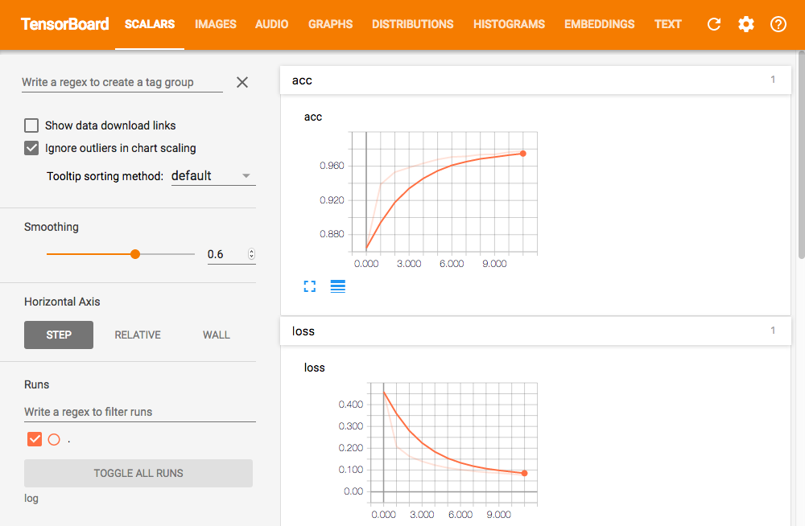

# TensorBoardとは

- TensorFlowの数値計算と機械学習過程を可視化するwebツール
  - 計算グラフ
  - step毎の損失関数



## 使い方

- ソースに適宜仕込んでおいて（後述），コマンドプロンプトから起動する

```
$ source ~/tensorflow/bin/activate // 必要に応じて
$ tensorboard --logdir=(ログディレクトリのパス)
```

- ブラウザで ```http://localhost:6006``` にアクセスする

```
http://localhost:6006
```

おそらくlogデータの上書きされないようなので，新しくログを生成する前に以前のログを削除した方が良い


## tf.nn API

- TensorBoardの書き出し（計算グラフの保存）

```
summary_writer = tf.summary.FileWriter("./log", sess.graph)
```

- 損失関数などを関する

```
# lossを監視する（適宜ループ内に書く）
tf.summary.scalar('loss', loss)
```


## Keras API

- 学習メソッドのコールバックにTensorBoardを書く

```
import os.path

logPath = "./log"
os.makedirs(logPath, exist_ok=True)

tb_cb = keras.callbacks.TensorBoard(log_dir=logPath, histogram_freq=1, write_graph=True)
cbks = [tb_cb]

model.fit(x_train,
          y_train,
          batch_size=batch_size,
          epochs=epochs,
          verbose=1,
          validation_data=(x_test, y_test),
          callbacks=cbks)
```


# 参考URL
- [[Keras/TensorFlow] KerasでTensorBoardの利用 - Qiita](http://qiita.com/agumon/items/114da6921c5dc4f7d7f9 "[Keras/TensorFlow] KerasでTensorBoardの利用 - Qiita")
- [Kerasのcallbackを試す（modelのsave,restore/TensorBoard書き出し/early stopping） - Qiita](http://qiita.com/yukiB/items/f45f0f71bc9739830002 "Kerasのcallbackを試す（modelのsave,restore/TensorBoard書き出し/early stopping） - Qiita")


